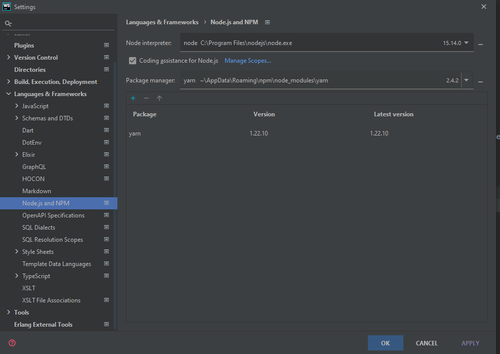

# Overview
This is a typescript seeder project.

# Tech stack
1. typescript
1. mocha
1. prettier
1. editor config
1. eslint
1. docker and docker compose

## Webstorm integration
### eslint
To get eslint working, make sure yarn is selected as package manager.

